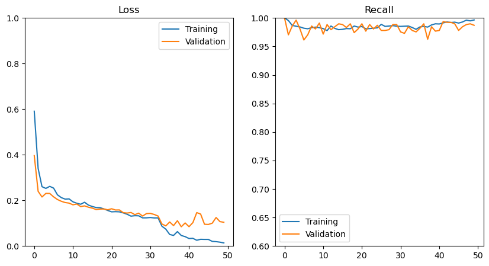

# xrayid


## Overview:
Neural Networks allow for a whole new world of classification solutions. Neural networks can pick up on patterns sometimes beyond the human eye. The challenge today is bringing a neural network to bear on identifying pnenomia in a human lung. 

## Business Problem:

Radiology is a crucial aspect of modern medicine, yet it remains inaccessible to a staggering 60% of the global population. While efforts to donate equipment and train technicians have improved accessibility to radiological services, the scarcity of skilled radiologists in many countries remains a challenge.

Telemedicine has emerged as a solution to circumvent this obstacle by facilitating the remote reading of scans by radiologists in other locations. However, this process can be time-consuming, with each scan taking a few days to receive a result, delaying the diagnosis and treatment of critical conditions such as pneumonia.

Acording to the World Health Organization, pneumonia is a leading cause of mortality among young children worldwide, claiming the lives of approximately 800,000 children under the age of five every year. Early diagnosis and prompt treatment are essential to improving patient outcomes and reducing healthcare costs, as delayed diagnosis can lead to extended hospital stays and higher mortality rates.

Research indicates that rapid diagnostic tests for pneumonia can significantly reduce the overuse of antibiotics, shorten hospital stays, and lower healthcare costs. Although a neural network cannot replace the expertise of a trained physician, developing tools to assist in the rapid and accurate diagnosis of radiological scans can improve the efficiency of healthcare services, enabling doctors to diagnose and treat more patients within the same time frame.

## Data:

The dataset used in this study is comprised of approximately 6,000 X-rays of children's lungs collected by the University of California San Diego and Guangzhou Women and Children's Medical Center in 2018. 

Link to data: [here](https://data.mendeley.com/datasets/rscbjbr9sj/3)

Kermany D, Goldbaum M, Cai W et al. Identifying Medical Diagnoses and Treatable Diseases by Image-Based Deep Learning. Cell. 2018; 172(5):1122-1131. doi:10.1016/j.cell.2018.02.010.

## Methods:

To improve the performance of our model and make it more robust, we employed a technique called data augmentation using the ImageDataGenerator module.

Essentially, the module takes existing images and applies various transformations to them, such as rotation, cropping, changing the orientation, and adjusting brightness, to generate new images. By doing so, it effectively creates more examples for the model to train on and allows for various perspectives of the same image, similar to taking multiple pictures of an object from different angles to gain a better understanding.

This technique is particularly useful in our case because not all lungs are positioned in the same way or have the same exposure when scanned. By creating more orientations through data augmentation, we can make our limited dataset more robust and effectively expand it, without the need for additional scans.

In addition to other model considerations, minimizing false negatives is a priority for our project. In other words, it is important to identify as many positive cases as possible to avoid missing any true cases. To achieve this objective, we have chosen recall as our validation metric, also known as sensitivity or true positive rate.

Recall measures the proportion of true positive cases out of all actual positive cases. By optimizing for recall, we prioritize the identification of all positive cases, even if some true negatives may be misclassified as false positives.

When diagnosing pneumonia in children, missing a positive case can have severe consequences and can lead to delayed treatment and potentially fatal outcomes. Therefore, maximizing sensitivity or recall is critical to identify as many positive cases as possible. However, it it important to note that optimizing for recall may result in a higher number of false positives, which can lead to unnecessary medical procedures and increased healthcare costs. Therefore, it is important to strike a balance between recall and precision in order to ensure the overall effectiveness of the model.

## Results:




After extensive testing, we achieved a 97% accuracy in identifying cases of pneumonia in children using chest X-ray images. This is a significant accomplishment, as it is difficult for even trained medical professionals to distinguish between pneumonia and other respiratory diseases based solely on X-rays. Pneumonia is characterized by the presence of infiltrates in the lungs, which are areas of fluid accumulation that indicate an immune response to a foreign body, such as bacteria or a virus.

Our model showed limitations when it came to distinguishing between viral and bacterial pneumonia cases when put into a multi-class model. It is also unable to identify other respiratory diseases such as lymphoma or cystic fibrosis due to limited data for testing and training. Additionally, we suspect that the model is identifying the brightness of the X-ray images rather than the specific characteristics of pneumonia. This suggests that the model is not specifically qualified to identify pneumonia but rather the presence of infiltrates in the lungs.

Unfortunately, the neural network is a black box model, making it difficult to determine if our susspicions are true. Nonetheless, this model remains a powerful tool in identifying cases of pneumonia in children, as the presence of infiltrates is a key factor in the diagnosis of pneumonia, and can be used in conjunction with other diagnostic methods to improve patient outcomes.


## Conclusions:

After refining our Convolutional Neural Network model, we achieved a remarkable 99% accuracy rate in detecting pneumonia in chest X-ray images. However, it is important to consider the timing of the X-ray in relation to the onset of the disease when implementing this model in a clinical setting. To further improve the accuracy of its predictions, we recommend enhancing the model's ability to differentiate between viral and bacterial cases, as well as other respiratory diseases.

Despite its current limitations, the model's ability to identify healthy lungs is a crucial step in pneumonia diagnosis. However, as it cannot differentiate between different types of pneumonia or other respiratory diseases, we recommend using the model in conjunction with other diagnostic methods to ensure accurate patient diagnosis.

In conclusion, our model can effectively detect the presence of pneumonia in 99.7% of infected patients, making it a valuable tool in decreasing the cost of treating respiratory illnesses and aiding in faster treatment times. Furthermore, it has the potential to assist in triaging patients based on the severity of their condition and optimize the allocation of valuable radiologist resources. Therefore, we suggest expanding the model's training data to include a wider range of respiratory illnesses and patient charts as factors in the network's decision-making process, and continuing to improve its ability to distinguish between viral and bacterial pneumonia.


## Next Steps:

Based on our findings, we believe that the model has the potential to become an even more powerful diagnostic tool for respiratory illnesses, beyond its current ability to identify pneumonia. While the current iteration can identify the presence of pneumonia with an impressive accuracy rate, there is still room for improvement in terms of differentiating between viral and bacterial cases, as well as other respiratory diseases. 

To achieve this, we recommend expanding the training data to include a wider range of respiratory illnesses, along with patient charts to provide further insight into each case. This will allow the model to make more informed decisions and provide more accurate predictions. Additionally, we plan to continue refining the model's ability to distinguish between viral and bacterial pneumonia, as this information is crucial for determining the appropriate treatment course. 

Furthermore, we aim to extend the model's scope by training it to identify other lung diseases that can be detected on X-rays, such as tuberculosis or lung cancer. This will expand the model's potential applications, and make it an even more valuable tool in diagnosing respiratory illnesses. Overall, we are excited to continue improving the model's capabilities and look forward to its continued success in the field of medical diagnostics.

```
├── images
│   ├── BarCharts.png
│   ├── logo.png
├── scratch_notebooks
│   ├── Alisons_notebook.ipynb
│   ├── GideonFinal_notebook.ipynb
│   ├── Gideon_noetbook.ipynb
│   ├── Kevins_notebook.ipynb
│   ├── Kevins_noetbook_3class.ipynb
├── .gitignore
├── Final_notebook.ipynb
├── Pneumonia_X-ray_Recognition_ppt-AP,GM,KA.pdf
└── README.md
```
